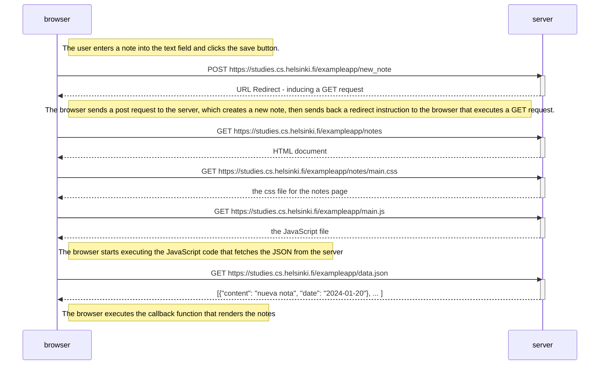

```mermaid
  sequenceDiagram
      participant browser
      participant server
  
      Note right of browser: The user enters a note into the text field and clicks the save button.
  
      browser->>server: POST https://studies.cs.helsinki.fi/exampleapp/new_note
      activate server
      server-->>browser: URL Redirect - inducing a GET request
      deactivate server
  
      Note right of browser: The browser sends a post request to the server, which creates a new note, then sends back a redirect instruction to the browser that executes a GET request.
  
      browser->>server: GET https://studies.cs.helsinki.fi/exampleapp/notes
      activate server
      server-->>browser: HTML document
      deactivate server
  
      browser->>server: GET https://studies.cs.helsinki.fi/exampleapp/notes/main.css
      activate server
      server-->>browser: the css file for the notes page
      deactivate server
  
      browser->>server: GET https://studies.cs.helsinki.fi/exampleapp/main.js
      activate server
      server-->>browser: the JavaScript file
      deactivate server
  
      Note right of browser: The browser starts executing the JavaScript code that fetches the JSON from the server
  
      browser->>server: GET https://studies.cs.helsinki.fi/exampleapp/data.json
      activate server
      server-->>browser: [{"content": "nueva nota", "date": "2024-01-20"}, ... ]
      deactivate server
  
      Note right of browser: The browser executes the callback function that renders the notes
```
