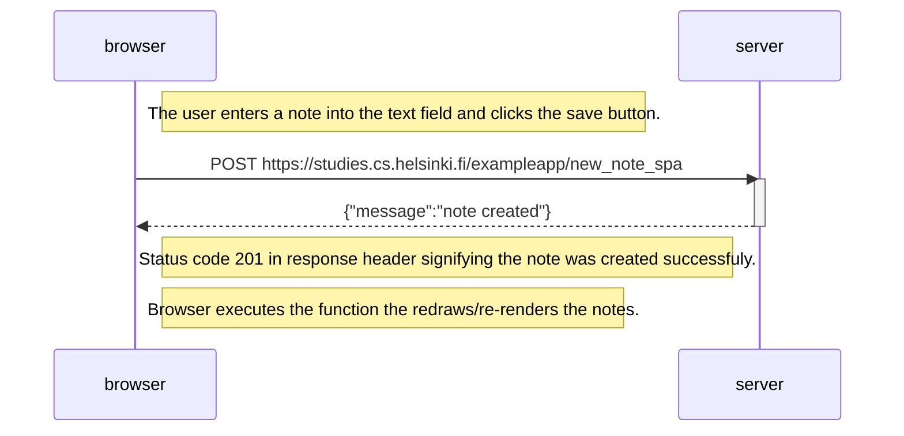

```mermaid
  sequenceDiagram
      participant browser
      participant server
  
      Note right of browser: The user enters a note into the text field and clicks the save button.
  
      browser->>server: POST https://studies.cs.helsinki.fi/exampleapp/new_note_spa
      activate server
      server-->>browser: {"message":"note created"}
      deactivate server
  
      Note right of browser: Status code 201 in response header signifying the note was created successfuly.
  
      Note right of browser: Browser executes the function the redraws/re-renders the notes.
```
