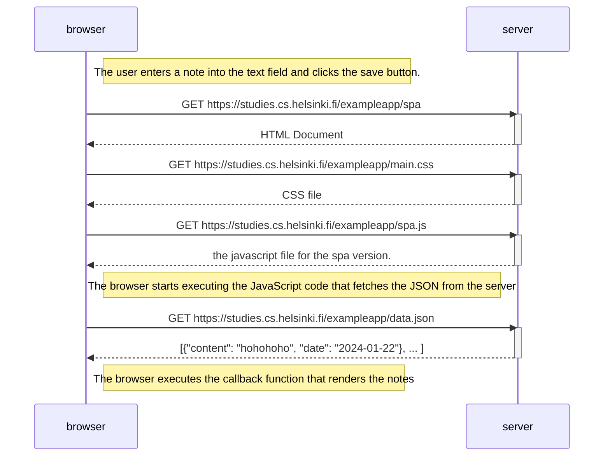

```mermaid
  sequenceDiagram
      participant browser
      participant server
  
      Note right of browser: The user enters a note into the text field and clicks the save button.
  
      browser->>server: GET https://studies.cs.helsinki.fi/exampleapp/spa
      activate server
      server-->>browser: HTML Document
      deactivate server
  
      browser->>server: GET https://studies.cs.helsinki.fi/exampleapp/main.css
      activate server
      server-->>browser: CSS file
      deactivate server
  
      browser->>server: GET https://studies.cs.helsinki.fi/exampleapp/spa.js
      activate server
      server-->>browser: the javascript file for the spa version.
      deactivate server
  
      Note right of browser: The browser starts executing the JavaScript code that fetches the JSON from the server
  
      browser->>server: GET https://studies.cs.helsinki.fi/exampleapp/data.json
      activate server
      server-->>browser: [{"content": "hohohoho", "date": "2024-01-22"}, ... ]
      deactivate server
  
      Note right of browser: The browser executes the callback function that renders the notes
```
